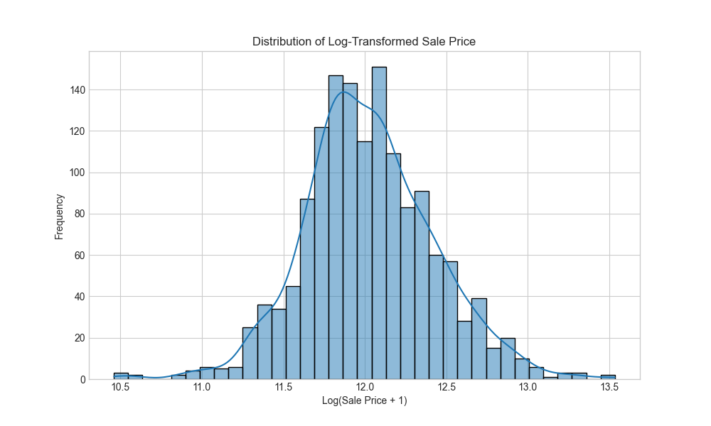
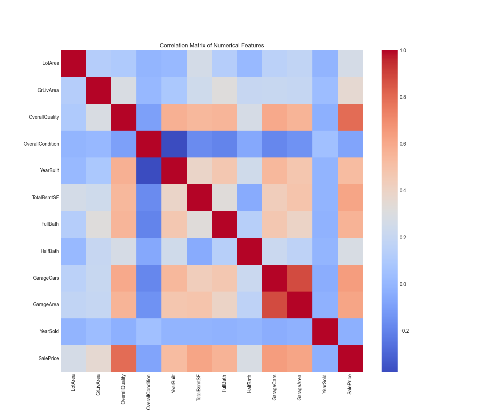
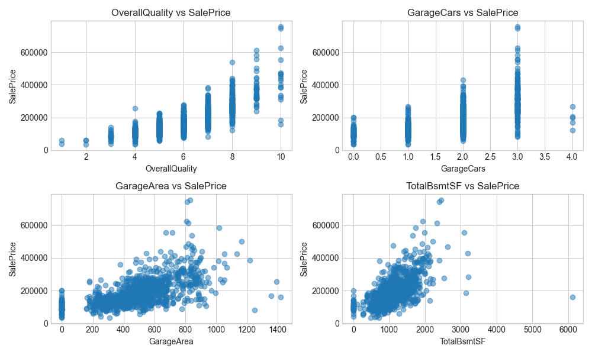

# 🏠 House Price Prediction

A machine learning pipeline that predicts house prices based on various features such as location, size, age, and amenities.

## 📋 Project Overview

This project implements a complete machine learning pipeline for predicting house prices. The pipeline includes data loading, exploratory data analysis, feature engineering, model training, evaluation, and visualization.

The code has been refactored to improve reusability and maintainability by extracting common functions into a utility module.

## 🗂️ Project Structure

```
ML-HOUSE-PRICE-PREDICTOR/
│
├── images/                  # Visualizations generated during analysis
├── data/dataset.csv         # Source data for house prices
├── example-usage.py         # Examples of using utility functions
├── house-price-main.py      # Main script for house price prediction
├── README.md                # This documentation
├── requirements.txt         # Required Python packages
└── utils.py                 # Utility functions for reuse
```

## 🔧 Features

- **Data Analysis**: Exploratory data analysis with visualizations
- **Feature Engineering**: Creates relevant features like house age, total square footage, etc.
- **Outlier Handling**: Removes outliers that could skew model performance
- **Missing Value Imputation**: Strategically handles missing values
- **Pipeline Architecture**: Uses scikit-learn pipelines for preprocessing and modeling
- **Model Evaluation**: Comprehensive metrics for model assessment
- **Feature Importance Analysis**: Identifies most influential predictors
- **Reusable Components**: Common functions extracted to utils.py for reuse

## 📊 Key Visualizations

### Distribution of Sale Prices

*The distribution of house sale prices shows a right-skewed pattern, indicating that most houses are in the lower to middle price range, with fewer high-priced properties.*

### Log-Transformed Sale Prices

*Applying a log transformation to the sale prices creates a more normal distribution, which is better for modeling.*

### Correlation Heatmap

*The correlation heatmap shows relationships between numerical features. Darker colors indicate stronger correlations.*

### Top Features vs Sale Price

*Scatter plots showing the relationship between the top features and sale price. Positive correlations are visible in most plots.*

### Predicted vs Actual Prices

*This plot compares the model's predictions with actual home prices. Points closer to the diagonal line indicate more accurate predictions.*

### Residual Analysis

*The residual plot helps identify if there are patterns in model errors. Ideally, residuals should be randomly distributed around zero.*

### Feature Importance

*This chart shows which features have the most influence on the model's predictions. Positive values indicate positive relationships with price, while negative values show inverse relationships.*

## 📊 Model Performance

The linear regression model achieves:
- R² score of approximately 0.75-0.85 on the test set
- Mean Absolute Error (MAE) of around $15,000-25,000
- Root Mean Squared Error (RMSE) of approximately $25,000-40,000

## 🚀 Getting Started

### Prerequisites

- Python 3.7+
- Required packages listed in `requirements.txt`

### Installation

1. Clone the repository:
   ```bash
   cd ML-HOUSE-PRICE-PREDICTOR
   ```

2. Install dependencies:
   ```bash
   pip install -r requirements.txt
   ```

3. Run the main script:
   ```bash
   python house-price-main.py
   ```

### Using Custom Models

You can also run the prediction with different regression models:

```python
from example-usage import run_house_price_custom_model

# Run with Ridge regression
run_house_price_custom_model(f"data/dataset.csv", "ridge", alpha=0.5)

# Run with Lasso regression
run_house_price_custom_model(f"data/dataset.csv", "lasso", alpha=0.01)
```

## 🧩 Code Components

### Main Pipeline (`house-price-main.py`)

The main script that executes the entire pipeline:
- Loads and analyzes data
- Performs feature engineering
- Trains a linear regression model
- Evaluates and visualizes results

### Utilities (`utils.py`)

Reusable functions for:
- Data loading and preprocessing
- Visualization functions
- Feature engineering
- Model building and evaluation
- Result analysis

### Example Usage (`example-usage.py`)

Demonstrates how to use the utility functions with different regression models.

## 📈 Future Improvements

- Implement more advanced models (Random Forest, Gradient Boosting)
- Add cross-validation for hyperparameter tuning
- Create a web interface for predictions
- Integrate with external data sources
- Implement automated feature selection

## 📄 License

This project is licensed under the MIT License - see the LICENSE file for details.

## 👥 Acknowledgments

- Original code by Randy Jin
- Refactored and documented for better reusability
